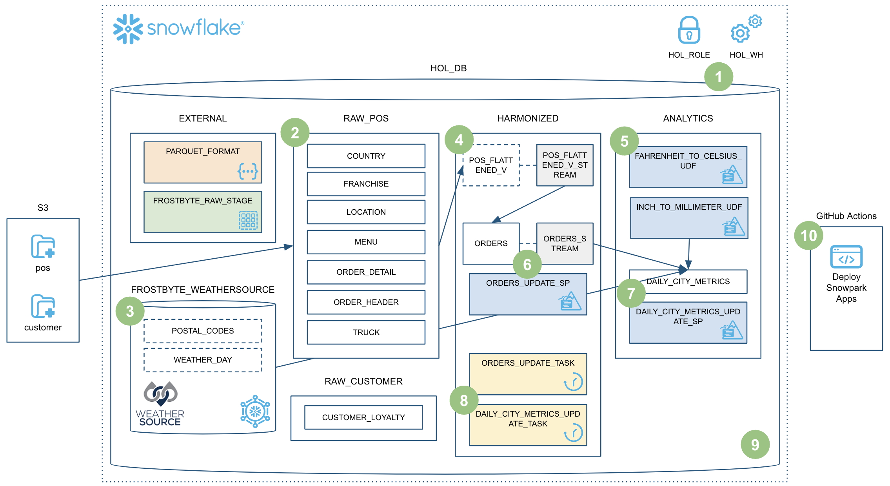

```
conda activate snowflake-demo
```

をはじめに入力する


```python
with Session.builder.getOrCreate() as session:
```

は、config.tomlから接続を見るのではなく、connections.tomlから確認する

connectionってもしかして今tutsじゃないのでは。だってこれチュートリアルの時に作ったやつのような、、、

うーん？sqlの実行が拡張機能からできるらしいがどう言うことだ？？


> identifier url

```
https://tmihexd-qx81869.snowflakecomputing.com
```

> Because we're using Snowflake's unique data sharing capability we don't actually need to copy the data to our Snowflake account with a custom ETL process.

snowflakeはsnowflkeでetl processを持っている。構造化データと半構造化データを扱える。
また、snowflakeでは、Snowflake Marketplace にデータを出しているプロバイダーのデータなら、ETLなしで使えるみたいな感じ。



tutorialにこのような図が書いてあったが、これはsnowflakeで作ったHOL_DBのアーキテクチャではなく、このtutorialによって作られるHOL_DBのアーキテクチャである。

snowflakeが提供するのは、あくまで実行基盤（DataFrame API / SP / Task）なので、ETL処理などは、自分で書く。

ETL処理は、pythonとかで書くことができる。この時、`snowpark` を使用する

`snowpark`とは、snowflake上でpythonやJavaとかを実行することができる仕組み。通常はsqlでしかかけない。つまり、これらのpythonとかは、RDBで言うところの`ストアドプロセージャ`に相当する。

このtutorialでは、天気を取り込んでいる。
天気のデータを何に使うかは見ものかもね。

<br>

`4.HARMONIZED` でPOSデータのViewを作ろうとしている。
これがやってることは何かというと、複数のデータソースを結合したりしたりあれこれしたりしてテーブルを作るって感じっぽい。

つまり、`ETL処理`として片付けようとしていたものに等しい

